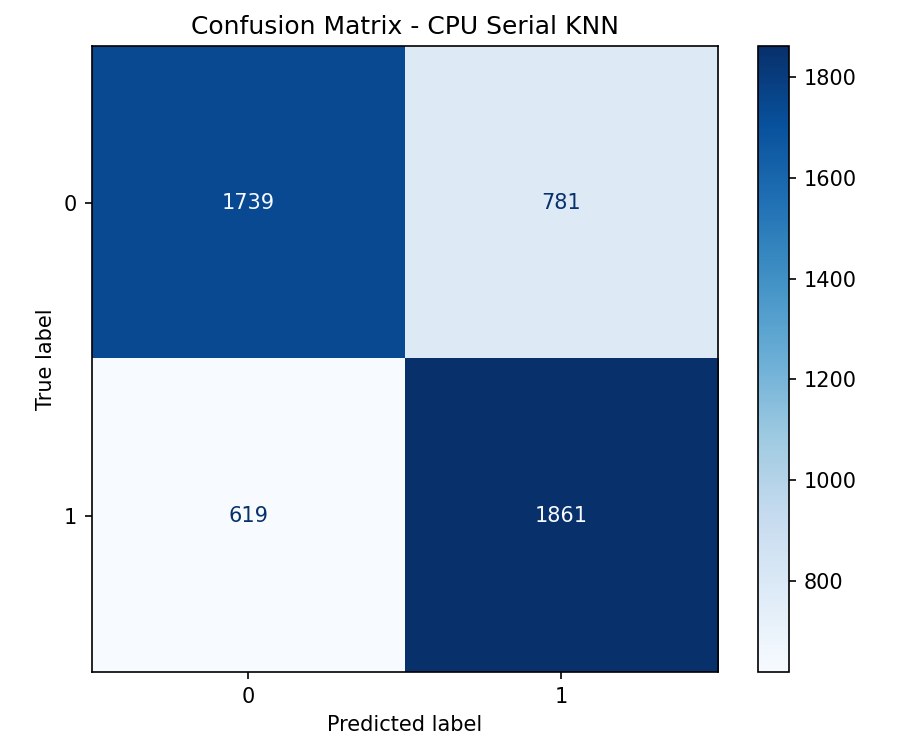
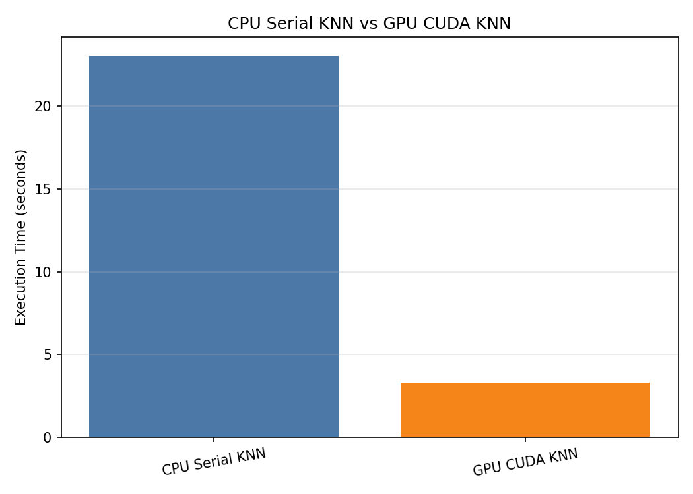

# CUDA-Based Parallel Processing for Diabetes Classification Using K-Nearest Neighbor

This project implements diabetes classification using the **K-Nearest Neighbor (KNN)** algorithm with two different approaches:

1. **CPU Serial KNN** as the baseline implementation.
2. **GPU CUDA KNN** as the parallel implementation for accelerating distance calculation.

The main purpose of this project is to evaluate how CUDA-based parallel computing can improve the execution performance of KNN classification while maintaining comparable prediction accuracy.

---

## Project Overview

K-Nearest Neighbor is a simple yet computationally expensive classification algorithm. For every test sample, KNN calculates the distance between the test data and all training samples. This process becomes increasingly expensive as the dataset size grows.

To address this issue, this project applies **CUDA parallel processing** to accelerate the distance computation stage of the KNN algorithm. The CPU implementation is used as a comparison baseline, while the GPU implementation uses thousands of CUDA threads to process distance calculations in parallel.

---

## Dataset

The dataset used in this project is the **Diabetes Health Indicators Dataset** based on BRFSS 2015 health survey data.

The notebook supports the following dataset files:

```text
data/raw/diabetes_binary_5050split_health_indicators_BRFSS2015.csv
data/raw/diabetes_binary_health_indicators_BRFSS2015.csv
```

In the experiment, the dataset used was:

```text
diabetes_binary_5050split_health_indicators_BRFSS2015.csv
```

Dataset summary:

| Description | Value |
|---|---:|
| Total samples | 70,692 |
| Total columns | 22 |
| Feature columns | 21 |
| Target column | `Diabetes_binary` |
| Class 0 samples | 35,346 |
| Class 1 samples | 35,346 |

The dataset is balanced, with an equal number of samples for both non-diabetic and diabetic classes.

---

## Project Structure

```text
.
├── data/
│   ├── raw/
│   │   └── diabetes_binary_5050split_health_indicators_BRFSS2015.csv
│   └── processed/
│       ├── X_train.csv
│       ├── X_test.csv
│       ├── y_train.csv
│       └── y_test.csv
├── outputs/
│   ├── figures/
│   │   ├── confusion_matrix.png
│   │   └── execution_time_comparison.png
│   └── results/
│       ├── evaluation_results.csv
│       └── gpu_predictions.csv
├── CUDA_KNN_Diabetes_Classification.ipynb
├── knn_cuda.cu
└── README.md
```

---

## Methodology

### 1. CUDA Environment Verification

The environment was verified using:

```bash
nvidia-smi
nvcc --version
```

The experiment was executed on an NVIDIA GPU environment with CUDA support.

GPU detected during execution:

```text
GPU: Tesla T4
CUDA Version: 13.0
```

---

### 2. Data Preprocessing

The preprocessing steps include:

- Loading the diabetes health indicators dataset.
- Separating features and target labels.
- Normalizing feature values using `StandardScaler`.
- Splitting the dataset into training and testing data.
- Saving the processed data into CSV files for CUDA execution.

The dataset split used:

```python
train_test_split(
    X,
    y,
    test_size=0.2,
    random_state=81,
    stratify=y
)
```

Experiment data size:

| Data | Shape |
|---|---:|
| Training data | 56,553 × 21 |
| Testing data | 5,000 × 21 |
| Training labels | 56,553 |
| Testing labels | 5,000 |

---

### 3. CPU Serial KNN

The CPU implementation uses manual Python loops to calculate Euclidean distance between each test sample and all training samples.

Configuration:

| Parameter | Value |
|---|---:|
| Algorithm | K-Nearest Neighbor |
| Distance metric | Euclidean distance |
| Number of neighbors | 5 |
| Implementation | Serial CPU |

---

### 4. GPU CUDA KNN

The GPU implementation is written in CUDA C/C++ and compiled using NVCC.

The CUDA program performs the following steps:

- Reads preprocessed training and testing data from CSV files.
- Launches CUDA kernels to calculate distances in parallel.
- Performs KNN voting to determine the predicted class.
- Saves prediction results into `outputs/results/gpu_predictions.csv`.

CUDA execution configuration:

| Configuration | Value |
|---|---:|
| Training samples | 56,553 |
| Testing samples | 5,000 |
| Features | 21 |
| Block size | 256 |
| Grid size | 1,104,551 |
| Total launched threads | 282,765,056 |

---

## How to Run

### 1. Prepare the Dataset

Place the dataset file inside the following directory:

```text
data/raw/
```

Recommended dataset file:

```text
data/raw/diabetes_binary_5050split_health_indicators_BRFSS2015.csv
```

---

### 2. Install Required Libraries

The Python implementation requires:

```bash
pip install numpy pandas matplotlib scikit-learn
```

---

### 3. Run the Notebook

Open and run the notebook:

```text
CUDA_KNN_Diabetes_Classification.ipynb
```

Make sure that the runtime has GPU support enabled.

---

### 4. Compile the CUDA Program

The CUDA source file is generated as:

```text
knn_cuda.cu
```

Compile it using:

```bash
nvcc -O3 knn_cuda.cu -o knn_cuda
```

---

### 5. Run the CUDA Program

Execute the compiled CUDA program:

```bash
./knn_cuda
```

The GPU prediction output will be saved to:

```text
outputs/results/gpu_predictions.csv
```

---

## Experimental Results

### Accuracy and Execution Time

| Method | Accuracy | Execution Time (seconds) | Speedup |
|---|---:|---:|---:|
| CPU Serial KNN | 0.7200 | 23.033822 | 1.0000× |
| GPU CUDA KNN | 0.7198 | 3.308060 | 6.9629× |

The GPU CUDA KNN achieved almost the same classification accuracy as the CPU Serial KNN while significantly reducing the execution time.

---

## Confusion Matrix

### CPU Serial KNN

| Actual / Predicted | Class 0 | Class 1 |
|---|---:|---:|
| Class 0 | 1,739 | 781 |
| Class 1 | 619 | 1,861 |

### GPU CUDA KNN

| Actual / Predicted | Class 0 | Class 1 |
|---|---:|---:|
| Class 0 | 1,739 | 781 |
| Class 1 | 620 | 1,860 |

The CPU and GPU confusion matrices are nearly identical. The prediction agreement between both implementations reached **99.82%**, showing that the CUDA implementation preserved the classification behavior of the serial version.

---

## Visualization

The notebook generates the following visualization outputs:

```text
outputs/figures/confusion_matrix.png
outputs/figures/confusion_matrix_cpu.png
outputs/figures/execution_time_comparison.png
```

### Confusion Matrix




### Execution Time Comparison



---

## Analysis

Based on the evaluation results, the CUDA-based KNN implementation successfully improved the execution performance compared to the CPU serial implementation. The CPU Serial KNN required **23.033822 seconds**, while the GPU CUDA KNN completed the same classification process in **3.308060 seconds**.

The GPU implementation achieved a speedup of approximately **6.96×**. This improvement was made possible because the distance calculation process, which is the most computationally intensive part of KNN, was parallelized using CUDA threads.

In terms of accuracy, the CPU implementation achieved **72.00%**, while the GPU implementation achieved **71.98%**. The accuracy difference was only around **0.02%**, which indicates that the GPU implementation produced results that were highly consistent with the CPU baseline.

Although the classification accuracy remained around 72%, the main focus of this project was not to maximize predictive performance, but to evaluate the benefit of parallel computing for KNN classification. The results show that CUDA can significantly reduce execution time while maintaining nearly the same prediction quality.

---

## Conclusion

This project demonstrates that CUDA-based parallel processing can effectively accelerate the K-Nearest Neighbor algorithm for diabetes classification. By parallelizing the distance calculation stage, the GPU implementation achieved a significant performance improvement compared to the serial CPU implementation.

Using 56,553 training samples, 5,000 testing samples, and 21 health indicator features, the GPU CUDA KNN achieved an execution time of **3.308060 seconds**, compared to **23.033822 seconds** on the CPU. This resulted in a speedup of approximately **6.96×**.

The accuracy difference between the CPU and GPU implementations was very small, with the CPU achieving **72.00%** and the GPU achieving **71.98%**. Therefore, the CUDA implementation successfully improved computational efficiency while preserving classification performance.

Overall, CUDA is proven to be an effective approach for accelerating computationally intensive KNN tasks, especially when dealing with large datasets that require repeated distance calculations.

---

## Technologies Used

- Python
- NumPy
- Pandas
- Matplotlib
- Scikit-learn
- CUDA C/C++
- NVCC Compiler
- Google Colab GPU Runtime

---

## Author

This project was developed to fulfill the final project requirement of the Parallel Computing course. The implementation focuses on comparing the performance of CPU-based serial processing and GPU-based CUDA parallel processing in K-Nearest Neighbor (KNN) diabetes classification.
